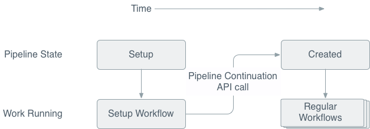

# Setup Workflows

Setup workflows are a new CircleCI feature which allow users to
dynamically generate configuration within a job, and by extension
dynamically decide which work to execute. The resulting work will be
executed within the same pipeline.

Prior to this feature, configuration of a pipeline was relatively
static: while we had [conditional steps](https://circleci.com/docs/2.0/reusing-config/#defining-conditional-steps) and [pipeline parameters](https://circleci.com/docs/2.0/pipeline-variables/#pipeline-parameters-in-configuration), it was
not possible to manipulate a pipeline's configuration in an arbitrary
way.

Setup workflows allow us to dynamically generate or manipulate our
configuration. This is a powerful means of extension and abstraction,
and enables features that were difficult to accomplish with static
configuration - for example [path filtering](./path-filtering.md) for monorepo support, or
[merging several configuration files](https://github.com/circle-makotom/circle-advanced-setup-workflow).

## Concepts

Setup workflows introduce new, optional pipeline lifecycle phases,
which allow work to be executed. Where previously a pipeline has
consisted of two phases:

1. Configuration Processing
1. Work Execution

it can now have two additional phases:

1. *Setup* Configuration Processing
1. *Setup* Work Execution
1. Configuration Processing
1. Work Execution



During the first phase, the _setup configuration_ is processed, which
describes the work to be executed during the _setup work execution_
phase. The workflow executed as part of the _setup work execution_ phase
is called a _setup workflow_. _Setup workflows_ are tagged as such in the
UI and API. The _setup workflow_ then continues the pipeline to enter
the next phase.

Behind the scenes this continuation is implemented as a call to a
[public pipeline continuation API](https://circleci.com/docs/api/v2/#operation/continuePipeline). This API accepts a _continuation key_,
which is a secret, unique-per-pipeline key, that is automatically
injected into the environment of jobs executed as part of a setup
workflow. We advise against extracting this key. It also accepts a
configuration string, as well as a set of pipeline parameters.

We provide several orbs to cover common use cases for setup workflows,
such as [path filtering](https://circleci.com/developer/orbs/orb/circleci/path-filtering).

This means each pipeline that has entered the setup phase has two
configurations, the _setup configuration_, and the regular
configuration.

## Limitations

Some limitations apply to setup workflows:

- the setup phase requires configuration version 2.1 or higher
- a pipeline can only be continued once
- a pipeline can only be continued within six hours of its creation
- a pipeline cannot be continued with another setup configuration
- there can only be one workflow in the setup configuration
- pipeline parameters submitted at continuation time cannot overlap
  with pipeline parameters submitted at trigger time
- pipeline parameters declared in the setup configuration must also be
  declared in the continuation configuration, and can be used at
  continuation time

## Enabling Setup Workflows

To enable setup workflows, simply enable "Setup Workflows" in the
project settings (under "Advanced"). Now you can push a setup
configuration to a branch. To designate a configuration as a setup
configuration, and thus trigger the setup phase, use the top-level
`setup: true` stanza (see below for a full example). Regardless of the
project setting, only setup configurations will trigger the setup
phase.

## Full Example

In this example we presume that a `generate-config` script or executable
exists, which outputs a YAML string, based on some work it performs.
It could potentially inspect git history, or pipeline values that get
passed to it, or do anything else you can do inside a job.

```yaml
version: 2.1

setup: true

orbs:
  continuation: circleci/continuation:0.1.2

jobs:
  setup:
    executor: continuation/default
    steps:
      - checkout
      - run:
          name: Generate config
          command: |
            ./generate-config > generated_config.yml
      - continuation/continue:
          configuration_path: generated_config.yml

workflows:
  setup:
    jobs:
      - setup
```

## Advanced Topics

### Using Custom Executors

Alternative executors can be used, but require certain dependencies to
be installed for the continuation step to work (currently: `curl`,
`jq`).

### Choosing not to Continue a Pipeline

If the setup workflow decides that no further work shall be executed,
it is good practice to finish the pipeline, avoiding accidental
continuation. The continuation orb has a command for this:

```yaml
steps:
  - continuation/finish
```

### Not Using the Continuation Orb

If you have special requirements not covered by the continuation orb,
you can implement the same functionality in different ways. Refer to
the [orb source code](https://app.circleci.com/pipelines/github/CircleCI-Public/continuation-orb) for reference.
